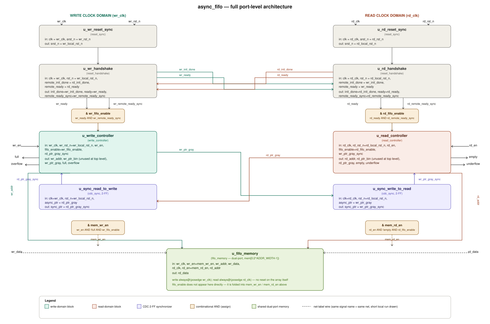

⚡ Asynchronous FIFO

Gray-Code CDC · Cross-Domain Reset Handshake · Self-Checking Verification

A dual-clock FIFO built around Gray-coded pointers, 2-flop synchronizers, and a
handshake-gated reset scheme — verified with an 18-test, scoreboard-based testbench.

 

📑 Table of Contents

Overview

Architecture

Clock Domain Crossing

Full / Empty Detection

Overflow / Underflow

Reset Design

Parameters

Interface

RTL Modules

Verification

Running the Simulation

Project Structure

Design Notes & Known Behavior

Roadmap

📖 Overview

This repository implements an asynchronous (dual-clock) FIFO in Verilog. The write
side and read side run on independent, unrelated clocks — data, pointers, and reset all
cross that boundary safely using industry-standard CDC techniques rather than ad-hoc
synchronization.

What it does, precisely:

Accepts writes on wr_clk and makes them available for reads on rd_clk, with no
fixed frequency or phase relationship required between the two.

Tracks occupancy using binary pointers, Gray-codes them before crossing domains, and
re-synchronizes with 2-flop synchronizers so only one bit ever changes per transfer.

Flags full / empty locally in each domain — never combined across domains, since
no real consumer of this FIFO would ever need to.

Flags overflow / underflow as one-cycle pulses when an already-full write or
already-empty read is attempted.

Holds both domains at reset until each has locally reset and confirmed the other
domain has too, via a dedicated handshake block.

🏗️ Architecture

The complete FIFO architecture is shown below.

  

<b>▸ Data path in one sentence, per direction</b>

Write → memory: wr_data + wr_en, gated by wr_fifo_enable and !full, are
accepted by write_controller, which increments wr_ptr_bin/wr_ptr_gray and drives
wr_addr into fifo_memory.

Memory → read: read_controller drives rd_addr into fifo_memory; the
registered result appears on rd_data one rd_clk cycle later, gated by
rd_fifo_enable and !empty.

Pointer crossing: wr_ptr_gray reaches the read domain via cdc_sync as
wr_ptr_gray_sync (used for empty detection); rd_ptr_gray reaches the write domain
the same way as rd_ptr_gray_sync (used for full detection).

🔀 Clock Domain Crossing

Binary pointers can't cross clock domains directly — multiple bits changing at once
means a synchronizer can sample a mix of old and new bits and produce a value that
never actually existed. The design avoids this in two layers:

flowchart LR
    A["Binary Pointer (wr_ptr_bin / rd_ptr_bin)"] --> B["Gray-Code Conversion only one bit changes per increment"]
    B --> C["2-Flop Synchronizer cdc_sync, resolves metastability"]
    C --> D["Opposite Clock Domain used for full / empty comparison"]

    style A fill:#1b262c,stroke:#90a4ae,color:#fff
    style B fill:#2a1a3d,stroke:#8e24aa,color:#fff
    style C fill:#2a1a3d,stroke:#8e24aa,color:#fff
    style D fill:#1b262c,stroke:#90a4ae,color:#fff

The write pointer is Gray-coded and synchronized into the read domain.

The read pointer is Gray-coded and synchronized into the write domain.

The pointer width is ADDR_WIDTH + 1 — the extra MSB is what lets full and empty
be told apart once the pointers wrap around the buffer.

🎯 Full / Empty Detection

Full — checked entirely in the write domain, against the synchronized read
pointer, with the top two bits inverted to distinguish "wrapped and full" from
"aligned and empty":

full_compare_ptr = rd_ptr_gray_sync;
full_compare_ptr[ADDR_WIDTH]   = ~rd_ptr_gray_sync[ADDR_WIDTH];
full_compare_ptr[ADDR_WIDTH-1] = ~rd_ptr_gray_sync[ADDR_WIDTH-1];
full_next = (wr_ptr_gray_next == full_compare_ptr);

Empty — checked entirely in the read domain, against the synchronized write
pointer, with a direct (non-inverted) compare:

empty_next = (rd_ptr_gray_next == wr_ptr_gray_sync);

Because each flag is computed independently in its own domain from a
synchronizer-delayed view of the other pointer, there's a brief real-world window
right after a burst where the write domain already knows it's full but the read
domain hasn't been told yet. That's expected CDC latency, not a race condition — see
Design Notes.

⚠️ Overflow / Underflow

One-cycle pulses that flag an already-rejected operation — the FIFO state itself is
never corrupted, since write_accept / read_accept already gate out the actual
write/read.

// write_controller — asserted when wr_en arrives while already full
overflow <= wr_en && full;

// read_controller — asserted when rd_en arrives while already empty
underflow <= rd_en && empty;

🔄 Reset Design

sequenceDiagram
    participant WRST as reset_sync (wr)
    participant WHS as reset_handshake (wr)
    participant RHS as reset_handshake (rd)
    participant RRST as reset_sync (rd)

    Note over WRST,RRST: wr_rst_n / rd_rst_n asserted (async)
    WRST->>WHS: wr_local_rst_n released (sync, 2 wr_clk edges)
    RRST->>RHS: rd_local_rst_n released (sync, 2 rd_clk edges)
    WHS->>WHS: wr_init_done = 1
    RHS->>RHS: rd_init_done = 1
    WHS-->>RHS: wr_init_done (2-flop synced)
    RHS-->>WHS: rd_init_done (2-flop synced)
    WHS-->>RHS: wr_ready (2-flop synced)
    RHS-->>WHS: rd_ready (2-flop synced)
    Note over WHS: wr_fifo_enable = wr_ready & wr_remote_ready_sync
    Note over RHS: rd_fifo_enable = rd_ready & rd_remote_ready_sync
    Note over WHS,RHS: Both domains now unblock their controllers

Each domain gets its own reset_sync: asynchronous assert, synchronous
de-assert — the standard glitch-free reset release.

Neither write_controller nor read_controller moves a pointer until its own
*_fifo_enable is high, which requires both local reset to have cleared and
the opposite domain to have confirmed it did too.

Re-triggering reset on either domain drops both fifo_enable signals, forces
pointers back to zero, and clears full/empty back to their power-up state.
The memory array itself is not cleared — see Design Notes.

⚙️ Parameters

Parameter

Default

Description

DATA_WIDTH

8

Width of each FIFO word

ADDR_WIDTH

4

Address width

FIFO_DEPTH

2^ADDR_WIDTH = 16

Number of storage locations

PTR_WIDTH

ADDR_WIDTH + 1 = 5

Pointer width (extra MSB disambiguates wrap)

🔌 Interface

<table>
<tr><td valign="top">

Write Side

Signal

Dir

Description

wr_clk

in

Write clock

wr_rst_n

in

Active-low async write reset

wr_en

in

Write enable

wr_data

in

Input data, [DATA_WIDTH-1:0]

full

out

FIFO is full

overflow

out

Write attempted while full

</td><td valign="top">

Read Side

Signal

Dir

Description

rd_clk

in

Read clock

rd_rst_n

in

Active-low async read reset

rd_en

in

Read enable

rd_data

out

Output data, [DATA_WIDTH-1:0]

empty

out

FIFO is empty

underflow

out

Read attempted while empty

</td></tr>
</table>

🧩 RTL Modules

<b>▸ Module breakdown</b>

Module

Role

async_fifo

Top level — instantiates and wires everything below

reset_sync

Async-assert / sync-deassert reset synchronizer (one per domain)

reset_handshake

Cross-domain init_done / ready exchange, generates *_fifo_enable

cdc_sync

2-flop synchronizer for Gray-coded pointers

fifo_memory

Dual-port storage array, no internal reset — qualified externally

write_controller

Write pointer, address generation, full, overflow

read_controller

Read pointer, address generation, empty, underflow

All modules currently live in a single Verilog source file (see
Project Structure).

✅ Verification

The design is verified with a self-checking SystemVerilog testbench: a
race-free shadow-register event checker for overflow/underflow, a queue-based
data scoreboard that only models writes the DUT actually accepted, and two
genuinely unrelated clock periods (wr_clk = 10 ns, rd_clk = 16 ns) to stress
the CDC paths for real.

<b>▸ Test list (18 tests)</b>

#

Test

Focus

1

Simultaneous reset / initialization

Both domains reset together, handshake completes

2

Single write / single read

Basic data integrity

3

Fill FIFO to full, reader stopped

full timing

4

DEPTH+1 write / overflow

Overflow pulses exactly once

5

Drain FIFO / empty

empty timing

6

DEPTH+1 read / underflow

Underflow pulses exactly once

7

Normal burst, reader stopped

Mid-occupancy behavior

8

Pointer wraparound

3 full laps around the buffer

9

Writer faster / reader stopped

Sustained overflow rejection

10

Reader faster / writer stopped

Sustained underflow rejection

11

Independent write-domain reset at half-full

Cross-domain enable drop/recovery

12

Independent read-domain reset at half-full

Cross-domain enable drop/recovery

13

Reset while FIFO is full

Full state clears correctly

14

Reset while enables are active

No corruption mid-transaction

15

Skewed reset release

Wildly staggered wr_rst_n / rd_rst_n timing

16

Reset with data in flight

Reset during an active read burst

17

Concurrent random stress

600 cycles/domain, randomized wr_en/rd_en

18

Overflow/underflow event summary

Zero mismatches vs. shadow model

<b>▸ Why the event checker is "race-free"</b>

A naive always @(posedge clk) if (overflow) counter++ monitor can race the DUT's
own same-edge nonblocking update and silently miss or double-count a single-cycle
pulse. This testbench instead mirrors the DUT's exact always-block priority (async
reset > !fifo_enable hold > normal update) in a single-driver shadow register, and
compares against the DUT on the opposite clock edge — eliminating the race
entirely rather than working around it with delays.

🚀 Running the Simulation

Icarus Verilog:

iverilog -g2012 -o sim tb/tb_async_fifo.sv rtl/async_fifo.v
vvp sim

ModelSim / Questa:

vlog -sv tb/tb_async_fifo.sv rtl/async_fifo.v
vsim -c tb_async_fifo -do "run -all; quit"

Expected tail of the log:

================================================
FINAL RESULTS
================================================
Directed checks : 60 passed / 0 failed / 60 total
Data integrity  : XXXX passed / 0 failed / XXXX total
Overflow event mismatches : 0
Underflow event mismatches: 0
RESULT: ALL CHECKS PASSED (.../...)
================================================

📁 Project Structure

Async-FIFO/
│
├── README.md
│
├── rtl/
│   └── async_fifo.v          # async_fifo, reset_sync, reset_handshake,
│                              # cdc_sync, fifo_memory, write_controller,
│                              # read_controller
│
├── tb/
│   └── tb_async_fifo.sv      # Self-checking testbench (18 tests)
│
└── docs/
    └── async_fifo_full_architecture.svg

All RTL modules currently live in one file; splitting into individual files is
tracked in Roadmap.

🔍 Design Notes & Known Behavior

Memory is not cleared on reset. Reset re-initializes pointers and control state
only. After any reset/reinitialization, treat prior memory contents as invalid —
don't rely on stale data surviving a reset.

full and empty are domain-local by design. Each is computed from a
synchronizer-delayed view of the other pointer, so comparing them together across
clock domains (e.g., in a testbench monitor) can show both true at once right after a
burst fills the FIFO. No real consumer samples both flags combinationally like that —
each is only ever used synchronously within its own domain — so this is expected CDC
behavior, not a functional bug.

fifo_enable adds latency after reset. The two-way init_done/ready exchange
costs a handful of clock edges (2-flop sync, each direction) before either controller
starts moving pointers. This is intentional and keeps both domains from touching
shared state before the other side is provably out of reset.

Minimum depth: the full-detection MSB-inversion trick requires ADDR_WIDTH >= 1
(depth ≥ 2); it has been verified functionally correct down to that minimum.

🗺️ Roadmap

Split RTL into one module per file

Add a lint-clean pass (Verilator --lint-only)

Parameterize FWFT (first-word-fall-through) as an option

Add a synthesis-oriented top-level wrapper with configurable almost-full/almost-empty thresholds

Built around Gray-code CDC and a handshake-gated reset — the two ideas that make an
async FIFO actually safe to put on silicon.

